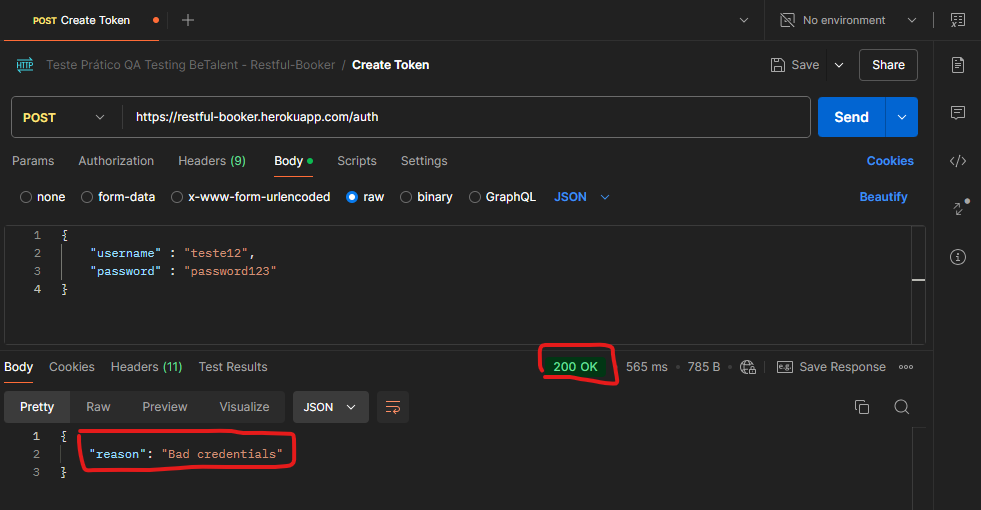
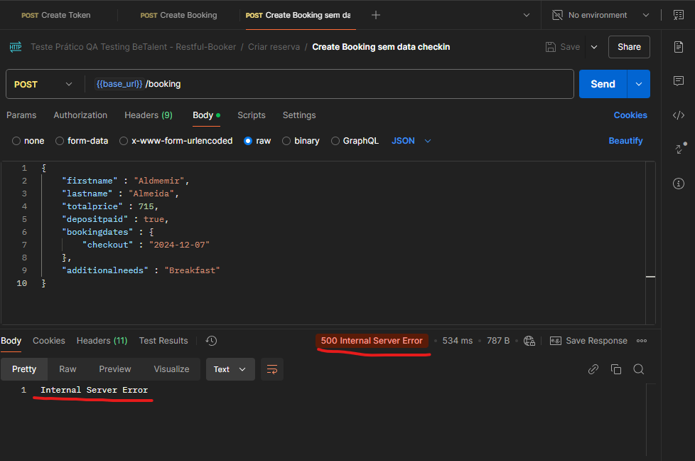
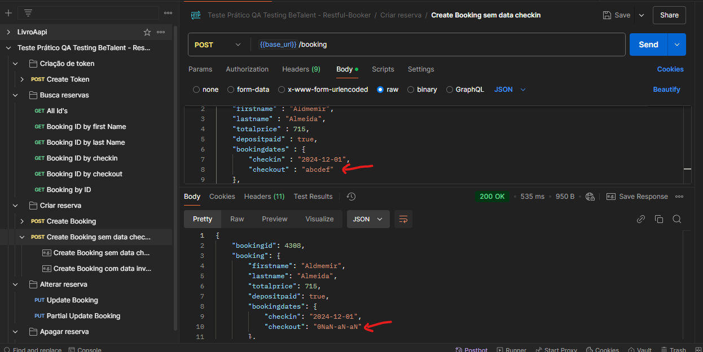
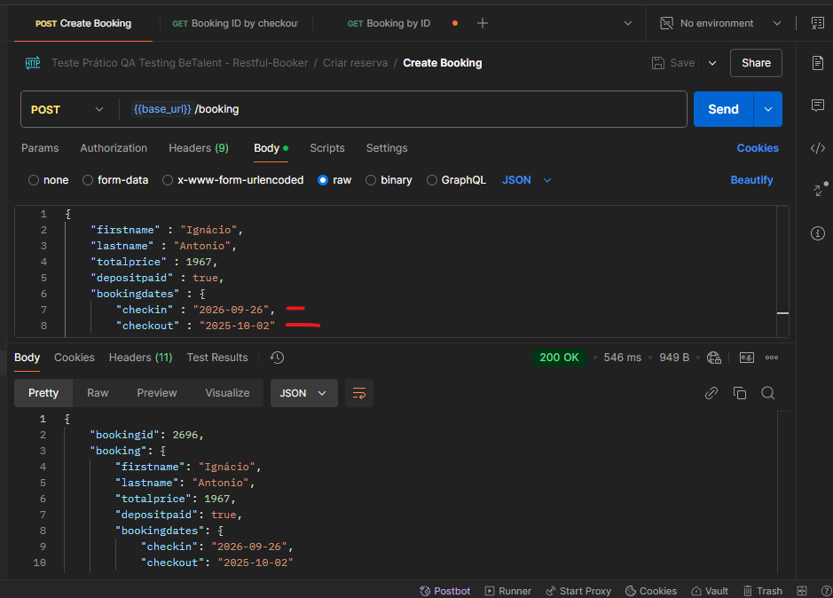
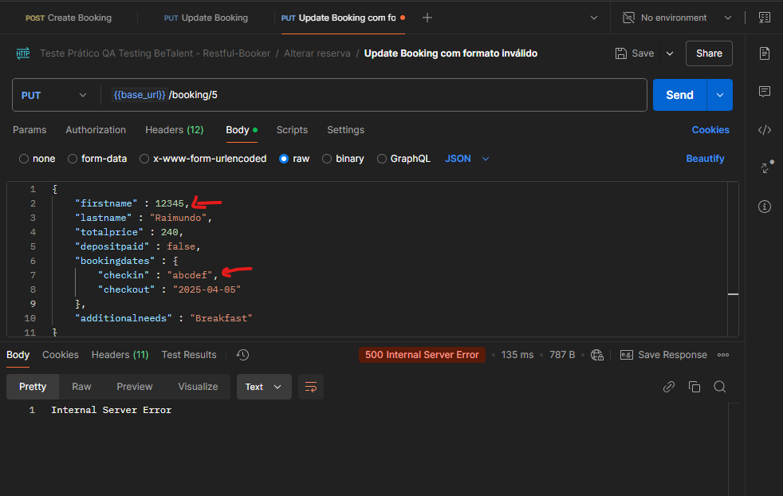
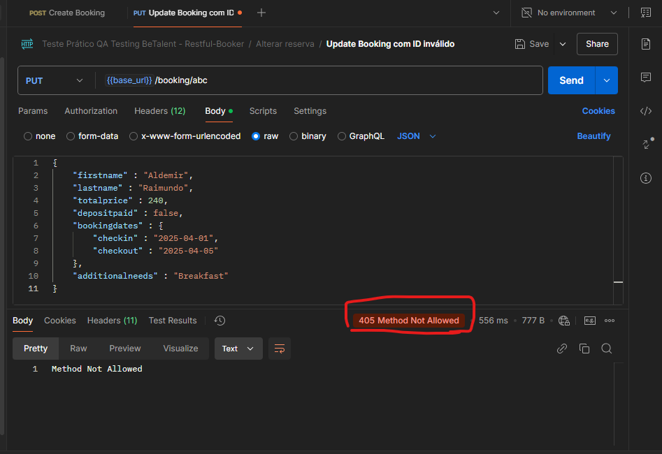
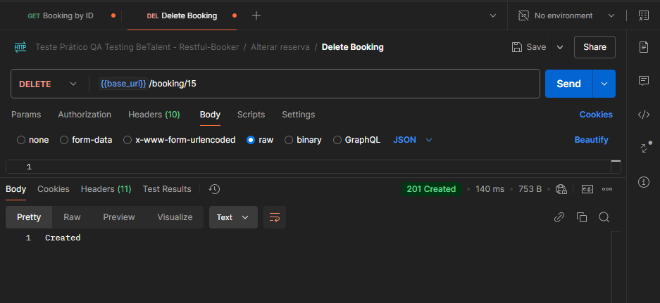
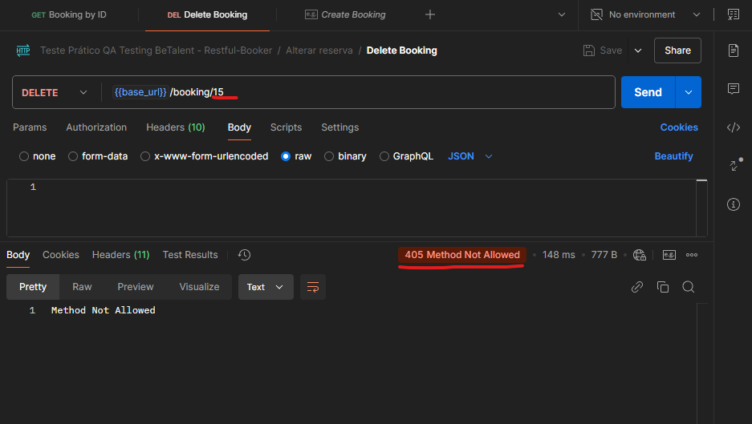
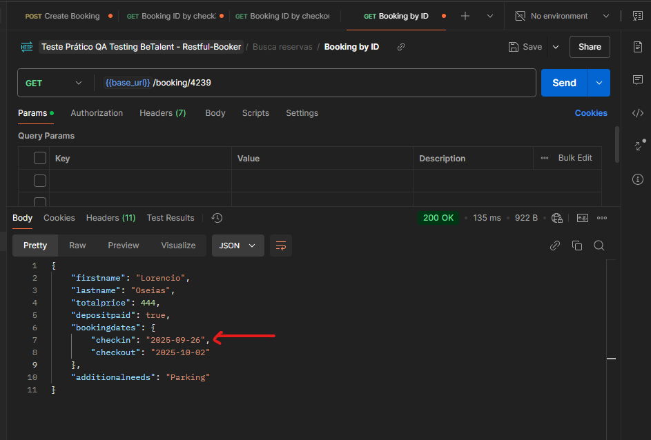
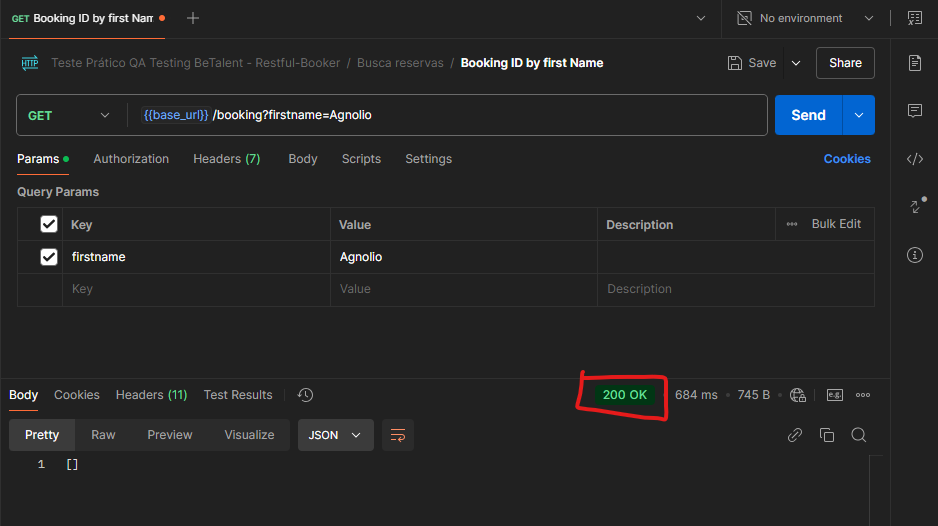

# Resultados e evidências dos testes

## Resultado Sumarizado
Aqui vamos sumarizar o resultado da execução dos testes listados no plano de teste.  

> OBSERVAÇÃO: Existe muitos cenários NOK, em que está atrelado um bug referente ao statusCode. Exemplo, na criação do token, a api realmente não criou o token quando foi enviado dados inválidos. O principal realmente estava OK, mas falhei o teste por um bug/melhoria no código de retorno.

Testes OK  ✅:  14
Testes NOK ❌:  23

## 2.2.1 Autenticação
✅ Verificar requisição POST na rota de criação de token com dados válidos  
❌ Verificar requisição POST na rota de criação de token com username inválido (BUG 1)  
❌ Verificar requisição POST na rota de criação de token com password inválido(BUG 1)  
❌ Verificar requisição POST na rota de criação de token com username não preenchido (BUG 1)  
❌ Verificar requisição POST na rota de criação de token com password não preenchido (BUG 1)  

## 2.2.2 Gestão de reservas

### Criação de reserva
✅⚠️ Verificar requisição POST na rota de criação de reserva com dados válidos (Melhoria 8)  
❌ Verificar requisição POST na rota de criação de reserva sem envio de algum campo obrigatório (BUG 2)  
❌ Verificar requisição POST na rota de criação de reserva com dados em formato inválido (BUG 3) (BUG 12)  

### Alteração de reserva
✅ Verificar requisição PUT na rota de alteração de reserva com autenticação e dados válidos  
✅ Verificar consulta de reserva após alteração de dados   
✅ Verificar requisição PUT na rota de alteração de reserva com Authorization  
✅ Verificar requisição PUT na rota de alteração de reserva com token gerado pela rota createToken  
❌ Verificar requisição PUT na rota de alteração de reserva com autenticação inválida (BUG 4)  
❌ Verificar requisição PUT na rota de alteração de reserva sem autenticação (BUG 4)  
❌ Verificar requisição PUT na rota de alteração de reserva com dados em formato inválido (BUG 5)  
❌ Verificar requisição PUT na rota de alteração de reserva com ID inválido (BUG 6)  

✅ Verificar requisição PUT na rota de alteração PARCIAL de reserva com autenticação e dados válidos  
✅ Verificar que rota de alteração PARCIAL permite envio de apenas alguns campos  
❌ Verificar requisição PUT na rota de alteração PARCIAL de reserva com autenticação inválida (BUG 4)  
❌ Verificar requisição PUT na rota de alteração PARCIAL de reserva sem autenticação (BUG 4)  

### Exclusão de reserva
❌ Verificar requisição DELETE na rota de excluir reserva com autenticação e ID válidos (BUG 7)  
✅ Verificar consulta de reserva após exclusão   
❌ Verificar requisição DELETE na rota de excluir reserva com ID inexistente (BUG 9)  
❌ Verificar requisição DELETE na rota de excluir reserva sem envio do ID (BUG 10)  
❌ Verificar requisição DELETE na rota de excluir reserva com autenticação inválida (BUG 4)  
❌ Verificar requisição DELETE na rota de excluir reserva sem autenticação (BUG 4)  

## 2.2.3 Filtros e buscas
✅ Verificar requisição GET na rota de consulta de ID de todas as reservas  
✅ Verificar requisição GET na rota de consulta de reserva filtrando por firstName  
✅ Verificar requisição GET na rota de consulta de reserva filtrando por lastName  
❌ Verificar requisição GET na rota de consulta de reserva filtrando por checkin (BUG 11)  
❌ Verificar requisição GET na rota de consulta de reserva filtrando por checkout (BUG 11)   
✅ Verificar requisição GET na rota de consulta por um ID específico  

❌ Verificar requisição GET na rota de consulta de reserva filtrando por firstName inexistente  (BUG 13)  
❌ Verificar requisição GET na rota de consulta de reserva filtrando por lastName inexistente (BUG 13)  
❌ Verificar requisição GET na rota de consulta de reserva filtrando por checkin inexistente (BUG 11)  
❌ Verificar requisição GET na rota de consulta de reserva filtrando por checkout inexistente (BUG 11)  
✅ Verificar requisição GET na rota de consulta por um ID inexistente  

## Evidências

### 2.2.1 Autenticação
✅ Verificar requisição POST na rota de criação de token com dados válidos
  

❌ Verificar requisição POST na rota de criação de token com username inválido (BUG 1)
  

❌ Verificar requisição POST na rota de criação de token com password inválido  (BUG 1)
  

❌ Verificar requisição POST na rota de criação de token sem envio do username

❌ Verificar requisição POST na rota de criação de token sem envio do password

## 2.2.2 Gestão de reservas

### Criação de reserva
✅ Verificar requisição POST na rota de criação de reserva com dados válidos  
  

❌ Verificar requisição POST na rota de criação de reserva sem envio de algum campo obrigatório 
 

❌ Verificar requisição POST na rota de criação de reserva com dados em formato inválido  

### Alteração de reserva  
✅ Verificar requisição PUT na rota de alteração de reserva com autenticação e dados válidos  
  

✅ Verificar consulta de reserva após alteração de dados  

✅ Verificar requisição PUT na rota de alteração de reserva com Authorization  
  

✅ Verificar requisição PUT na rota de alteração de reserva com token gerado pela rota createToken
  

❌ Verificar requisição PUT na rota de alteração de reserva com autenticação inválida  
  

❌ Verificar requisição PUT na rota de alteração de reserva sem autenticação 

❌ Verificar requisição PUT na rota de alteração de reserva com dados em formato inválido
   

❌ Verificar requisição PUT na rota de alteração de reserva com ID inválido

✅ Verificar requisição PUT na rota de alteração PARCIAL de reserva com autenticação e dados válidos  
  

✅ Verificar que rota de alteração PARCIAL permite envio de apenas alguns campos  
  

❌ Verificar requisição PUT na rota de alteração PARCIAL de reserva com autenticação inválida  
  

❌ Verificar requisição PUT na rota de alteração PARCIAL de reserva sem autenticação  
  

### Exclusão de reserva
❌ Verificar requisição DELETE na rota de excluir reserva com autenticação e ID válidos  
  

✅ Verificar consulta de reserva após exclusão  
  
  
  

❌ Verificar requisição DELETE na rota de excluir reserva com ID inexistente  

❌ Verificar requisição DELETE na rota de excluir reserva sem envio do ID  

❌ Verificar requisição DELETE na rota de excluir reserva com autenticação inválida  

❌ Verificar requisição DELETE na rota de excluir reserva sem autenticação  

## 2.2.3 Filtros e buscas
✅ Verificar requisição GET na rota de consulta de ID de todas as reservas  
   

✅ Verificar requisição GET na rota de consulta de reserva filtrando por firstName 
   

✅ Verificar requisição GET na rota de consulta de reserva filtrando por lastName
   

❌ Verificar requisição GET na rota de consulta de reserva filtrando por checkin  
  

❌ Verificar requisição GET na rota de consulta de reserva filtrando por checkout 
  

✅ Verificar requisição GET na rota de consulta por um ID específico  
  

❌ Verificar requisição GET na rota de consulta de reserva filtrando por firstName inexistente  

❌ Verificar requisição GET na rota de consulta de reserva filtrando por lastName inexistente  
  

❌ Verificar requisição GET na rota de consulta de reserva filtrando por checkin inexistente  
  

❌ Verificar requisição GET na rota de consulta de reserva filtrando por checkout inexistente
    
  

✅ Verificar requisição GET na rota de consulta por um ID inexistente  
  