# Bugs e/ou melhorias encontrados
Listaremos aqui, bugs e possíveis melhorias que podem ser incrementadas no funcionamento da api

## 1 - Rota de criar token, está apresentando statusCode 200 quando credenciais são inválidas
A API não permite a criação do token, porém retorna com 200, e este não é o melhor statusCode para esta situação. Se enquadra como melhoria.
    Talvez a melhor opção fosse "401 (Unauthorized)" para dados inválidos.
    E para cenários com algum dado não enviado, o 400 (Bad request). 
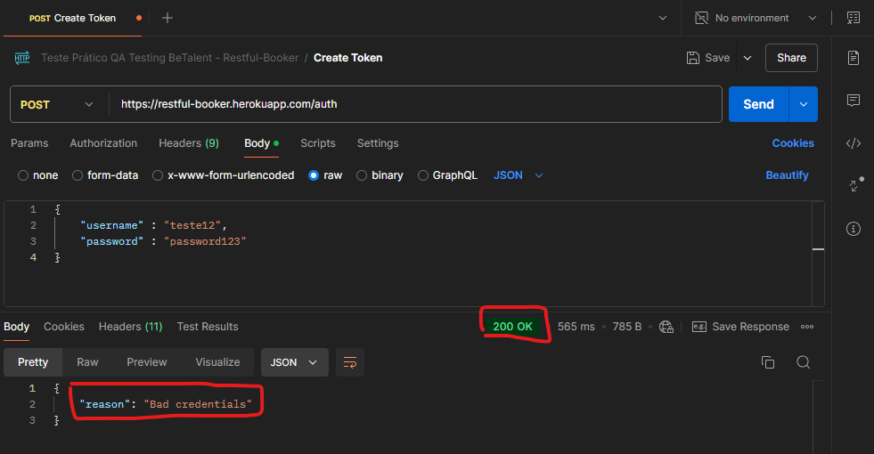

## 2 - Ao tentarmos cadastrar uma reserva sem data de checkin, a api está retornando statusCode 500.
Ao efetuarmos uma requisição POST na rota "https://restful-booker.herokuapp.com/booking/" para cadastramos uma reserva, e não enviar um dos parâmetros obrigatórios, no caso a data de checkin, a api retorna statusCode "500 - Internal server error".
Este erro está voltado mais para um erro do servidor, e não da requisição do cliente. Por este motivo, seria mais adequado alterar o código do erro, para 400 - Bad request.  
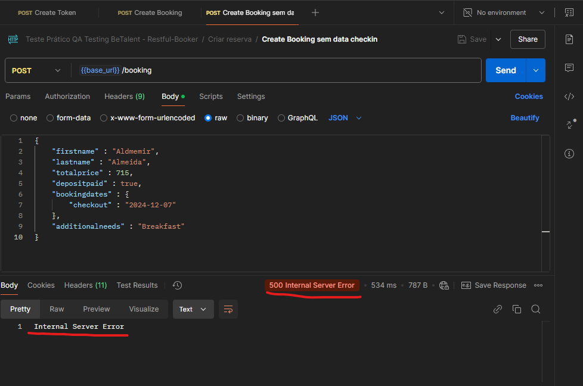  

## 3 - A api está aceitando dados inválidos nos campos de data
Ao realizar uma requisição POST para efetuar uma reserva, e substituir a data de checkout por dados inválidos (ex: abcdef), a api aceita, efetua a reserva e retorna 200, ficando assim, com uma dado ilegível.
O correto seria a api bloquear por dado inválido, e retornar um 400.  
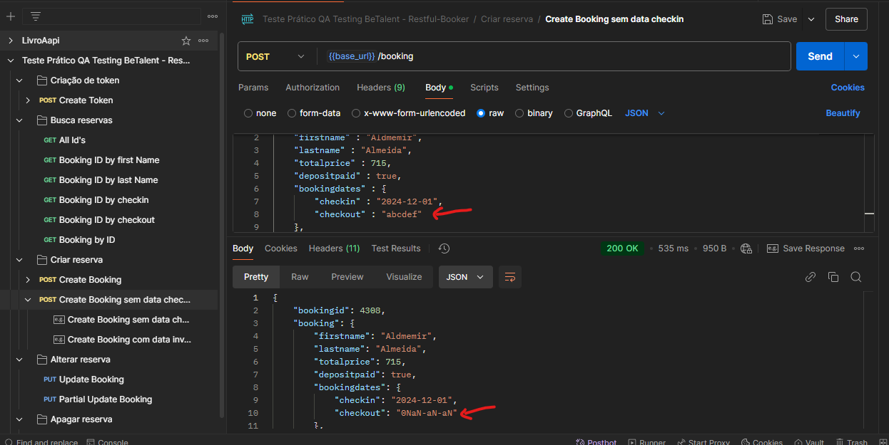

## 4 - A rota de alterar reserva está apresentando statusCode 403 para token inválido / não envio do token
Esta resposta geralmente está atrelada a um usuário que está autenticado, mas não possui permissão. Neste caso o token é inválido, neste caso, a melhor opção seria o 401 - Unauthorized.  
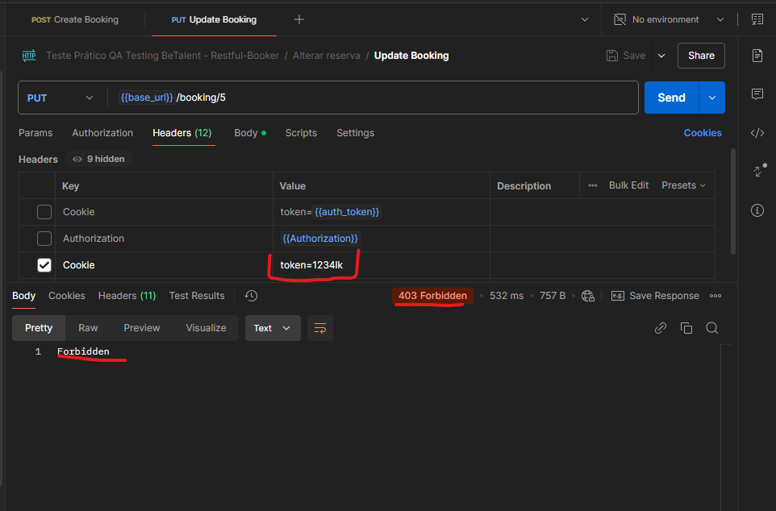  

## 5 - Ao tentarmos alterar uma reserva enviando dados inválidos, a api está retornando statusCode 500
A api retorna statusCode "500 - Internal server error" quando enviamos o nome como numérico por exemplo,
este erro está voltado mais para um erro do servidor, e não da requisição do cliente. Por este motivo, seria mais adequado alterar o código do erro, para 400 - Bad request.  
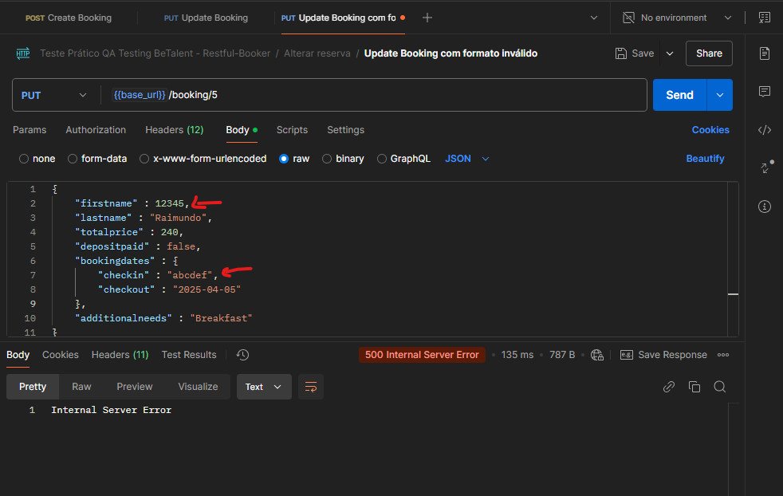 

## 6 - Ao tentarmos efetuar uma requisição na rota de alterar reserva com ID inválido, a api retorna 405
Ao efetuarmos uma chamada PUT - {{base_url}}/booking/abc, com um ID inválido , a api retorna 405 - Method not Allowed, que é um erro para informar que o método não é permitido.
Mas neste caso, o erro não é esse, e sim a requisição com um ID inválido. Neste caso, o status Code 400 - Bad request seria o mais ideal.  
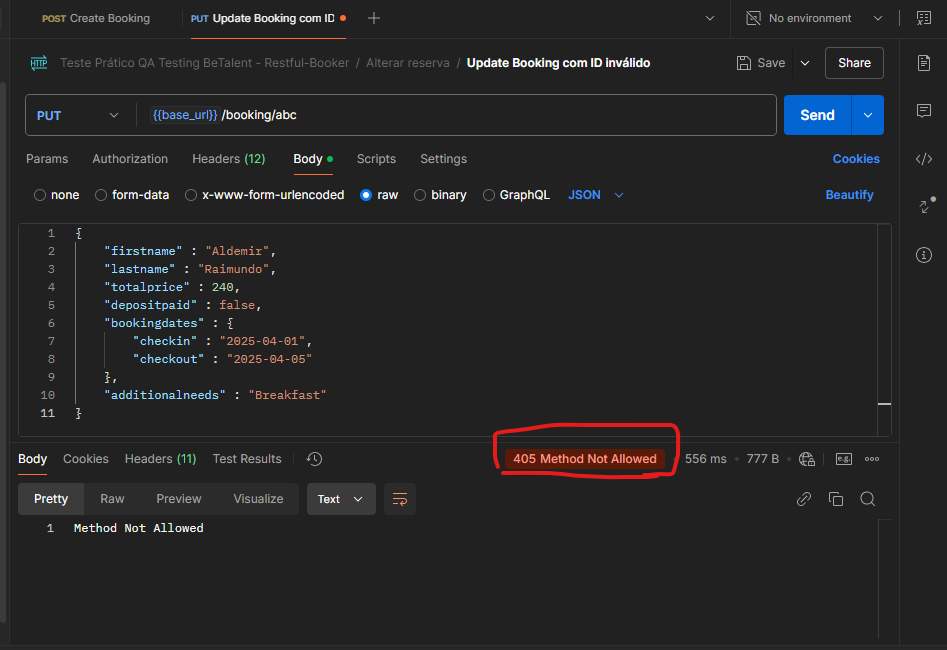  

## 7 - Ao deletar uma reserva, a api está retornando 201 -Created
Para este cenário, seria mais adequado um código 204 ou 200.  
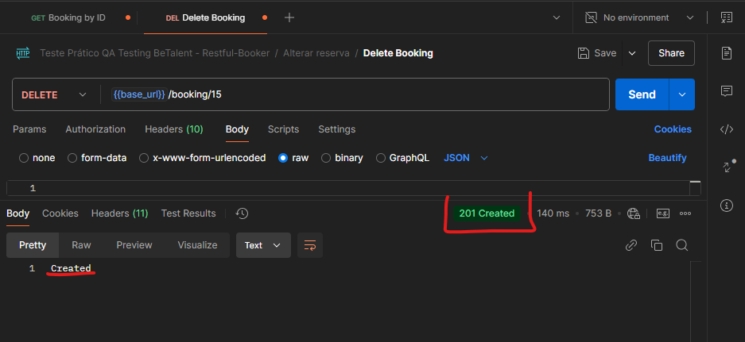   

## 8 - Criação de uma reserva com método POST retorna 200
A reserva é criada com sucesso, mas uma melhoria, seria retornar o código 201 - Created.  
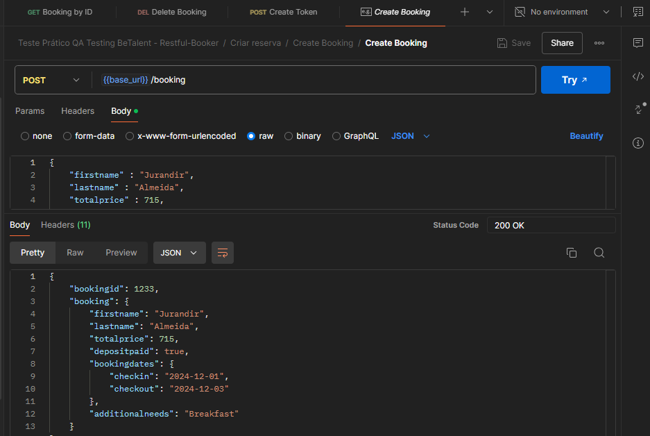  

## 9 - Ao tentar deletar uma reserva com ID inexistente, a api apresenta statusCode 405
Ao tentar excluir uma reserva que já foi exluída, a api retorna 405 - Method not Allowed, que é um erro para informar que o método não é permitido.
Neste caso, o erro mais adequado seria 404 - Not Found  
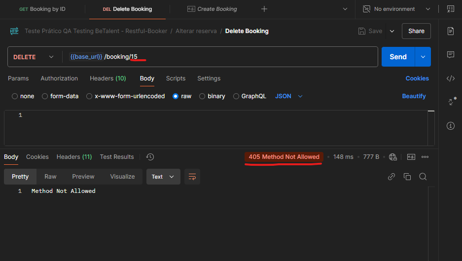

## 10 - Na rota de deletar reserva, se não enviar o ID, a api retorna 404 - bad request
Para este cenário, o erro mais ideal seria o 400 - Bad request, pelo fato do problema estar na falta do id na requisição.  
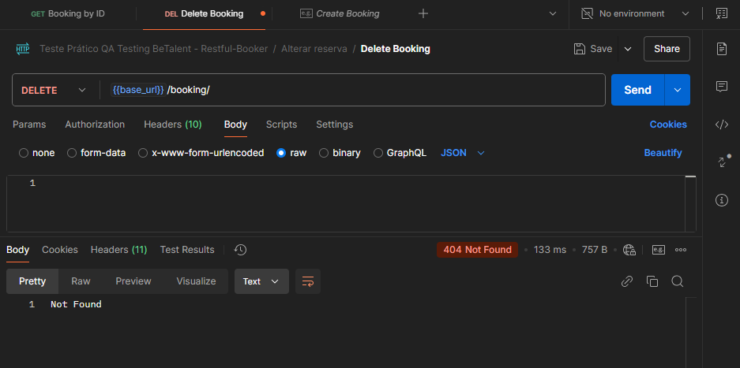  

## 11 - Busca por checkin não retorna reservas corretas
Ao cadastrar uma reserva, e efetuar uma consulta pela data de checkin, a api retorna com ID'S que não possuem a data, e deixa de fora ID'S que possuem a data.
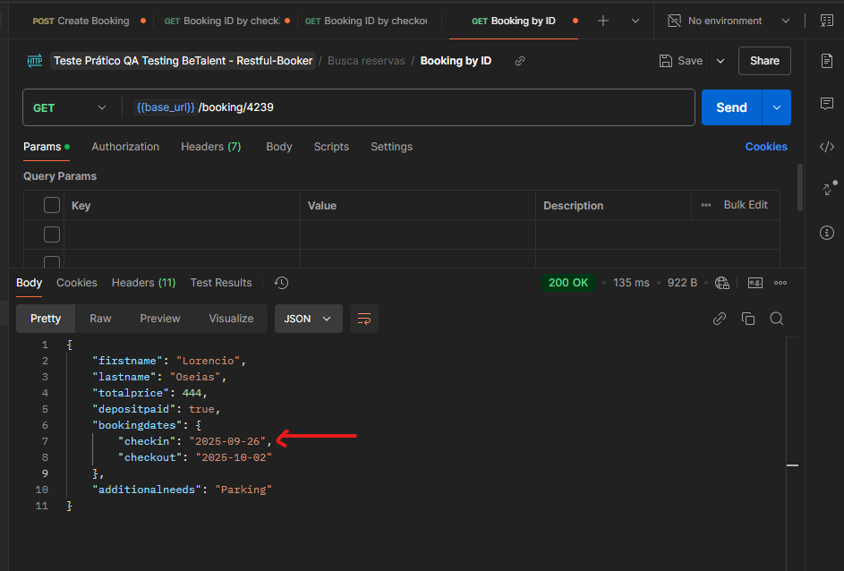   
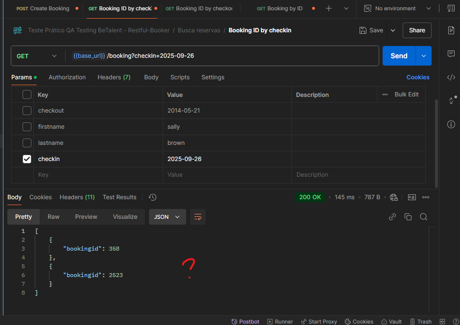  

## 12 - Rota POST  de criar reserva permite data de checkout anterior a data de checkin
O ideal seria incluir regras, para validar as datas inseridas, e afim de evitar informações erradas.
Possíveis regras: 
    - Data de checkout não pode ser menor ou igual a de checkin;
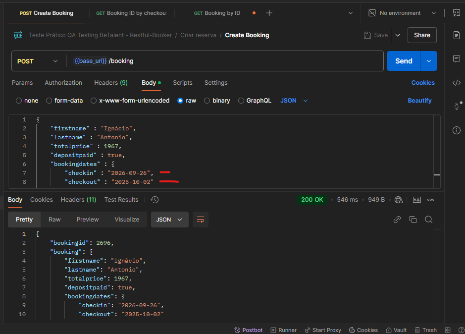  

## 13 - Nas rotas de buscas, ao inserirmos algum dado inexistente, a api está retornando 200
O mais adequado para este cenário seria retornar algo que remeta que a reserva não foi encontrada, como 404 - Not found.  
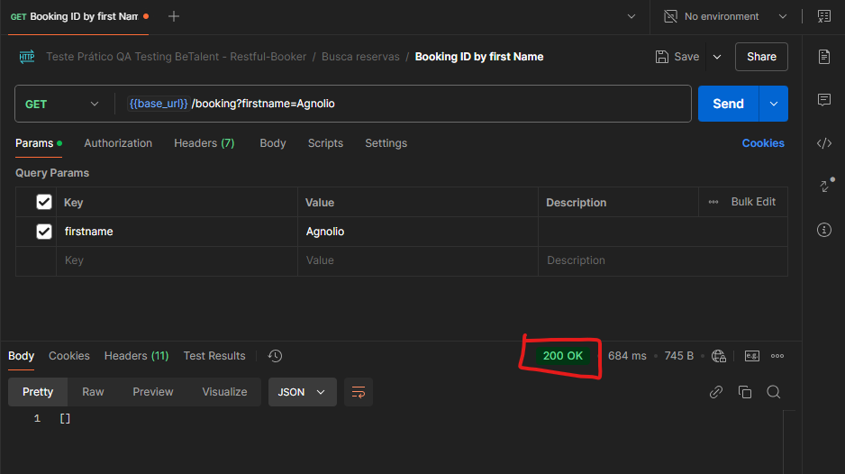