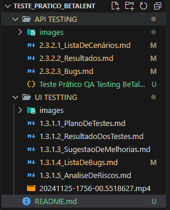
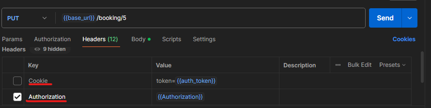
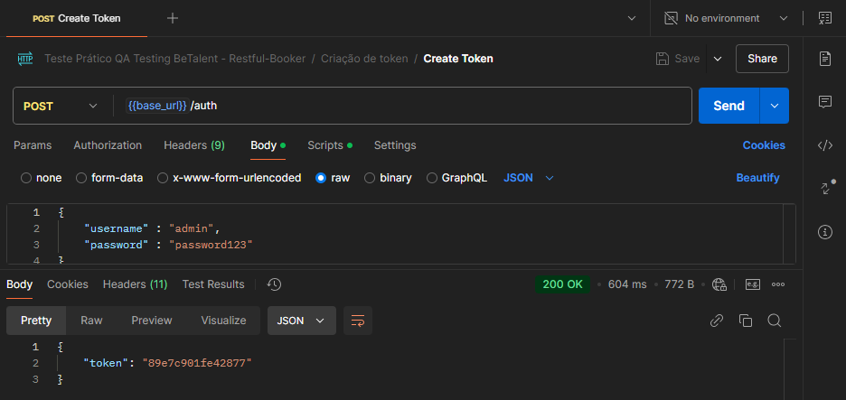
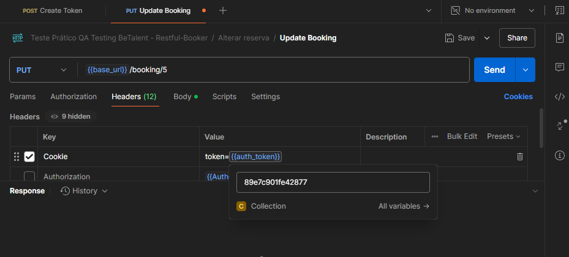

# Teste prático QA

Este diretório contém os desafios técnicos do processo de avaliação de QA, na qual é constituído de parte UI, parte API. Por conta disto, separamos em 2 pastas , com seus respectivos entregáveis.  

Considerações: 

> UI: Devido ao tempo, montamos um escopo dos principais cenários, e na parte de evidências, foram exemplificados os mandatórios citados no desafio.

> API: Contém todo o escopo principal também, com suas respectivas evidências;
       Lista de bugs também com evidências.
       Collection: 
            Todos os requests organizados por pasta
            Em alguns casos, além das evidências no arquivo .md, deixamos algumas na própria collection.
            Contém também as variáveis base_Url, Authorization, e auth_token. Então basicamente para as rotas que necessitam, possuem 2 formas de autenticar, authorization e cookie. 

>Caso opte pela opção de cookie, necessário efetuar uma chamada na rota de 'CreateToken' para atualizar o token expirado.  
1- Executar a requisição post create token:  
  
2 - Após isso, selecionar a autenticação cookie e prosseguir com a requisição:  
  

Qualquer dúvida, estou à disposição
Renan Dias 

