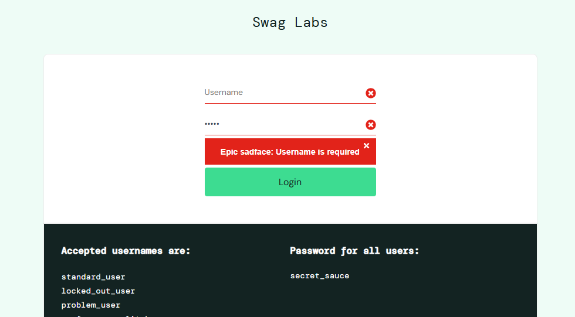

# Resultado dos testes

## Resultado Sumarizado
Aqui vamos sumarizar o resultado da execução dos testes listados no plano de teste:

>OBS.: Exceto os cenários que especificam o perfil do usuário, iremos rodar essa execução de testes utilizando o usuário "Standard", porém notamos que algumas funcionalidades não funcionam para outros usuários (bugs listados no 1.3.1.4),  estes cenários vão estar identificados com o ícone ⚠️ junto do aprovado.

Testes OK  ✅:  31  
Testes NOK ❌:  3    

### Login
✅ Verificar login com usuário válido  
✅ Verificar login com usuário que simula lentidão  
❌ Verificar login com usuário "visual_user" - (Bug 3)  
✅ Verificar tentativa de login com usuário bloqueado  
✅ Verificar tentativa de login com usuário inválido - (Sugestão de melhoria 3)  
✅ Verificar tentativa de login com senha inválida - (Sugestão de melhoria 3)  
✅ Verificar mensagem de erro quando campo usuário não for preenchido  
✅ Verificar mensagem de erro quando campo senha não for preenchido  

### Ordenação
✅⚠️ Verificar na tela inicial a ordenação dos produtos por nome (A to Z)  
✅⚠️ Verificar na tela inicial a ordenação dos produtos por nome (Z to A)  
✅⚠️ Verificar na tela inicial a ordenação dos produtos por preço do mais barato ao mais caro  
✅⚠️ Verificar na tela inicial a ordenação dos produtos por preço do mais caro ao mais barato  

### Detalhe do produto
✅ Verificar direcionamento a tela de detalhe do produto após clique no nome  
❌ Verificar preço e informações exibidos no detalhe do produto  (Bug 4)
✅ Verificar inclusão de item no carrinho via tela de detalhe do produto  
✅ Verificar remoção do item do carrinho via tela de detalhe do produto  

### Carrinho
✅ Verificar ícone de carrinho com a quantidade de produtos selecionados  
✅ Verificar que produtos adicionados são exibidos no carrinho  
✅ Verificar remoção de itens do carrinho  
✅ Verificar que item removido não é exibido na tela de checkout  
✅ Verificar funcionamento do botão "Continue Shopping" na tela do carrinho  
✅ Verificar funcionamento do botão "Checkout" na tela do carrinho quando possuir itens  
❌ Verificar funcionamento do botão "Checkout" na tela do carrinho quando NÃO possuir itens (Bugs 5 e 6)  
✅⚠️ Verificar avanço para a tela de pagamento após preenchimentos dos campos obrigatórios na tela de checkout  (Bug 7)
✅ Verificar funcionamento do botão "Cancel" na tela de checkout  
✅ Verificar mensagem de erro na tela de checkout quando campo First Name não for preenchido  
✅⚠️ Verificar mensagem de erro na tela de checkout quando campo Last Name não for preenchido  (bug 7)
✅ Verificar mensagem de erro na tela de checkout quando campo Zip/Postal Code não for preenchido  
✅ Verificar mensagem de erro na tela de checkout quando nenhum campo for preenchido   (Melhoria 7)  

### Fluxo de compra
✅ Verificar que todos os produtos adicionados são exibidos na tela de pagamento  
✅ Verificar o preço total exibido na tela de pagamento  
✅ Verificar efetivação de compra com sucesso  
✅ Verificar funcionamento do botão "Back Home" após conclusão da compra  

### Logout
✅ Verificar funcionamento da opção "Logout" no menu localizado a esquerda  

==================================================================

## Evidência dos principais testes
Aqui vamos exibir algumas evidências dos principais testes solicitados:

✅ Verificar login com usuário válido  
Dado que o cliente acesse a página de login do e-commerce Swag Labs  
Quando efetuar o login com dados válidos  
Então a página inicial é exibida, com os produtos disponíveis  
  

✅ Verificar tentativa de login com usuário bloqueado  
Dado que o cliente acesse a página de login do e-commerce Swag Labs  
Quando tentar efetuar o login com um usuário bloqueado  
Então a seguinte mensagem será exibida: "Epic sadface: Sorry, this user has been locked out."  
E os campos User e password serão destacados em vermelho  

✅ Verificar mensagem de erro quando campo usuário não for preenchido  
Dado que o cliente acesse a página de login do e-commerce Swag Labs  
Quando tentar efetuar o login sem preencher o campo User  
Então a seguinte mensagem será exibida: "Epic sadface: Username is required" 
 

✅⚠️ Verificar na tela inicial a ordenação dos produtos por preço do mais caro ao mais barato 
Dado que o cliente esteja na página inicial do Swag Labs  
Quando clicar na opção de ordenar do mais caro ao mais barato  
Então os produtos serão reorganizados, do maior ao menor preço  

❌ Verificar preço e informações exibidos no detalhe do produto  (Bug 4)
Dado que o cliente esteja na página inicial do Swag Labs  
Quando acessar a página de detalhe de algum produto  
Então será exibido o nome e preço do produto conforme cadastrado  
obs.: Teste realizado com o visual_User

✅ Verificar remoção de itens do carrinho  
Dado que o cliente tenha selecionado alguns produtos  
Quando remover algum produto na tela do carrinho  
Então a lista de produtos não irá exibir o produto removido  

❌ Verificar funcionamento do botão "Checkout" na tela do carrinho quando NÃO possuir itens (Bugs 5 e 6)  
Dado que o cliente esteja na página do carrinho  
E não tenha selecionado nenhum produto  
Quando tentar avançar para a próxima página   
Então o cliente não conseguirá, pois o botão checkout estará desabilitado  

✅ Verificar efetivação de compra com sucesso  
Dado que o cliente tenha selecionado o produto  
E preenchido todas as informações necessárias do fluxo de pagamento  
Quando finalizar a compra  
Então será exibido uma tela de "Thank you for your order!", com a mensagem "Your order has been dispatched, and will arrive just as fast as the pony can get there!"  

✅ Verificar funcionamento da opção "Logout" no menu localizado a esquerda  
Dado que o cliente esteja logado no Swag Labs  
Quando clicar na função de logout no menu superior esquerdo  
Então a aplicação é redirecionada para a página de login  

