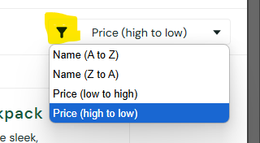
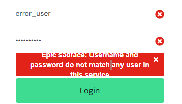
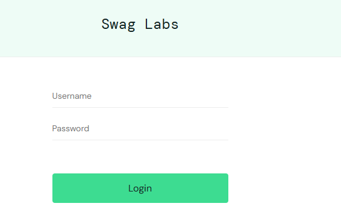
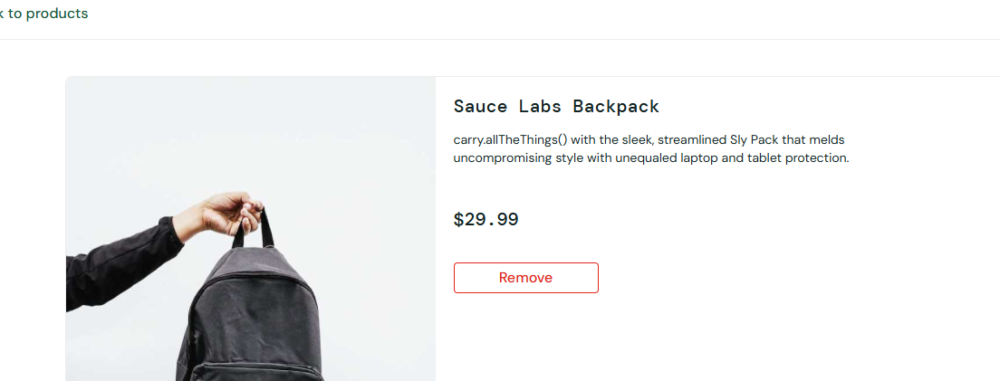
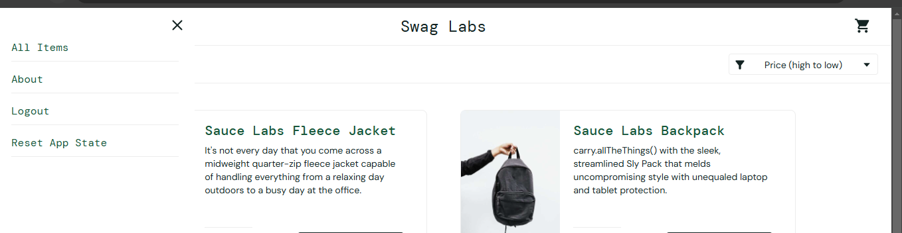
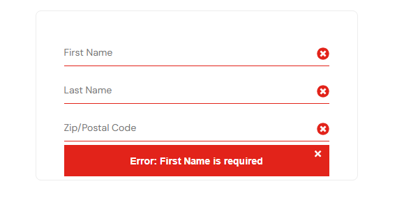

# Sugestão de melhorias

1 - O título "SWAG LABS" poderia ser clicável, com redirecionamento a tela inicial.
        Isto existe nos principais sites, e navegando, enquanto estava em outras telas, senti falta.

2 - A tela de inicío possui um ícone de filtro, porém, ao clique, é exibido as opções de ordenação.
        Seria válido alterar o ícone, para um que represente ordenação.  
        

3 - Mensagem de erro com usuário ou senha inválida, é apresentada com a frase cortada.
        Seria válido aumentar o tamanho do espaço reservado para o aviso, afim de exibir a mensagem de forma clara.  
        

4 - Botão de login poderia permanecer bloqueado até o preenchimento dos campos obrigatórios
        Hoje, ele é clicável mesmo sem preenchimento dos campos.  
        

5 - Inclusão da opção de quantidade na tela de detalhe do produto
        Hoje, não existe essa opção, permitindo o cliente selecionar apenas 1 unidade do produto selecionado.  
        

6 - Incluir alguma identificação do usuário, como por exemplo o nome.
        Ao logarmos com um usuário, não existe sequer uma identificação na página inicial.  
        

7 - Ao não preencher nenhum campo na tela de checkout, uma mensagem de erro é apresentada, especificando apenas o first name como obrigatório.
        Poderia existir uma mensagem mais genérica para o caso de nenhum campo preenchido, como "Os campos destacados são obrigatórios."   
        

8 - Incluir uma tela de pedidos realizados.  