# BUG'S
Abaixo, a lista com alguns dos bugs encontrados, uma breve descrição e evidência.
Alguns bugs abaixo foram identificados em testes exploratórios. 

## 1 - Funcionalidades estão quebradas ao acessar o SwagLabs com o usuário "problem_user".
O login ocorre com sucesso, porém, as imagens de todos os produtos estão alteradas, por uma foto de cachorro;  
    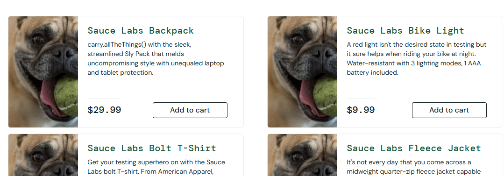
A aplicação não permite nenhuma ordenação. O campo exibe as opções, porém o clique exibe uma mensagem de funcionalidade quebrada:  
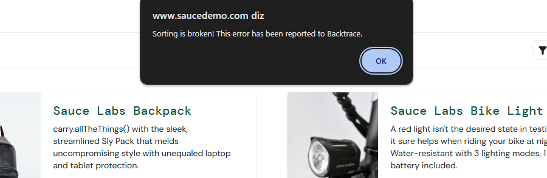

## 2 - A imagem do produto "Sauce Labs BackPack" na tela de início está divergente do esperado.
Ao logarmos no site com o user : "visual_user", a tela inicial está apresentando o produto "Sauce Labs BackPack" com a foto de um cachorro, quando deveria ser a imagem do produto:  
      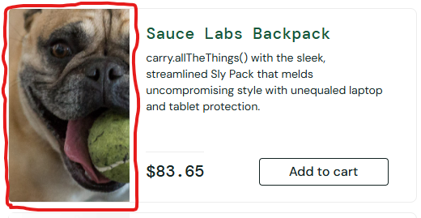
Imagem esperada:  
      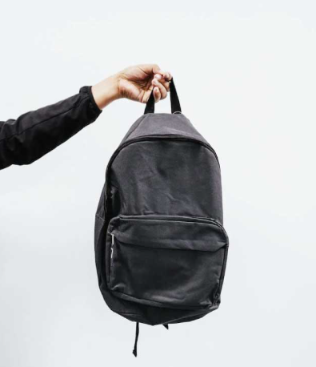

## 3 - A posição do ícone de carrinho está divergente no login com o user "visual_user"
Layout quebrado:  
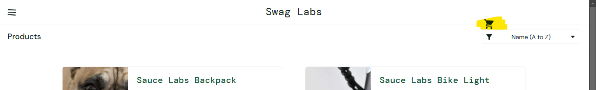
Layout esperado:  
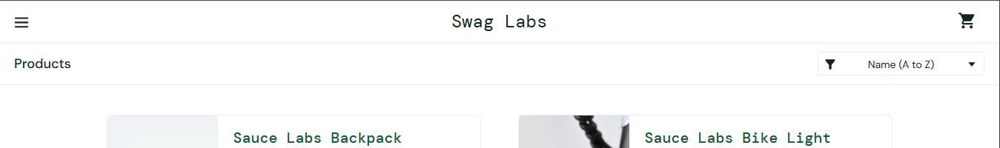

## 4 - Preços estão divergentes entre a 'tela inicial' e a tela 'detalhe do produto'
Ao logarmos na aplicação com o usuário "visual_user", a tela inicial apresenta os preços dos produtos divergentes dos preços exibidos na tela de detalhe do produto.
Outro detalhe, é que a cada atualização da página, um novo preço é exibido.
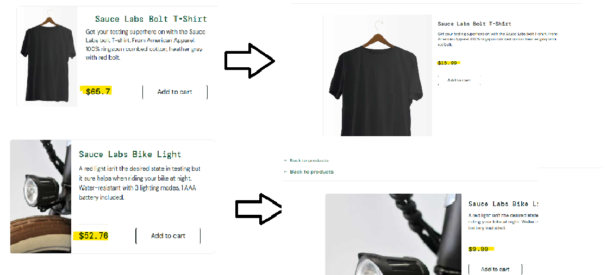

## 5 - A aplicação permite avançar todo o fluxo de compra sem nenhum produto no carrinho
Se acessarmos o carrinho sem conter nenhum item, e clicar no botão "Checkout", a aplicação direciona para a próxima tela do fluxo, solicitando os dados, quando deveria exibir alguma mensagem de aviso, ou, manter o botão desabilitado até a inclusão de algum item.
Chegando na tela de checkout, e preenchendo os campos, o site permite avançar para a tela de pagamento, e posteriormente permite finalizar a compra, exibindo inclusive mensagem de sucesso.
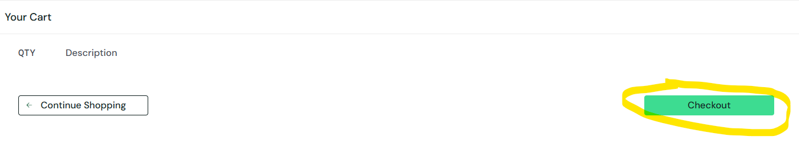
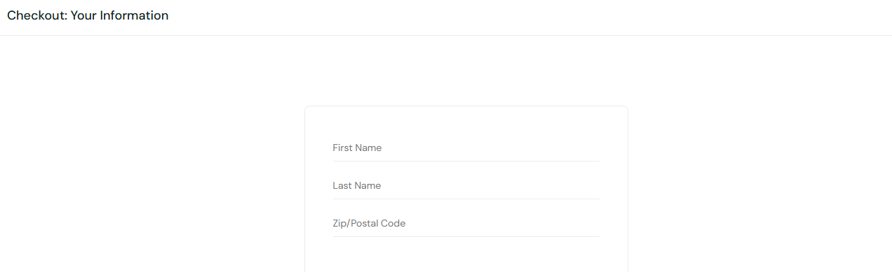
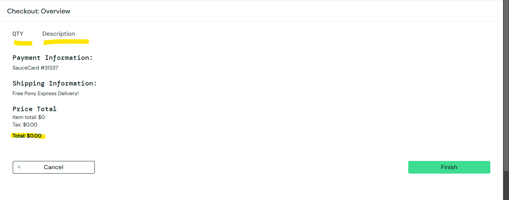
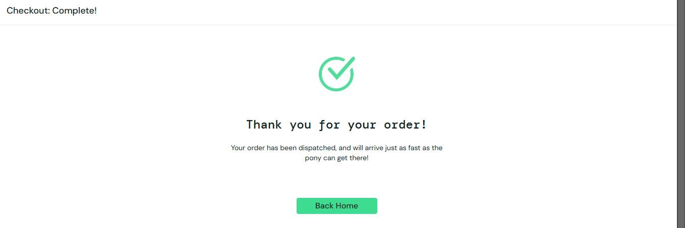

## 6 - A posição do botão de Checkout está divergente no login com o user "visual_user"
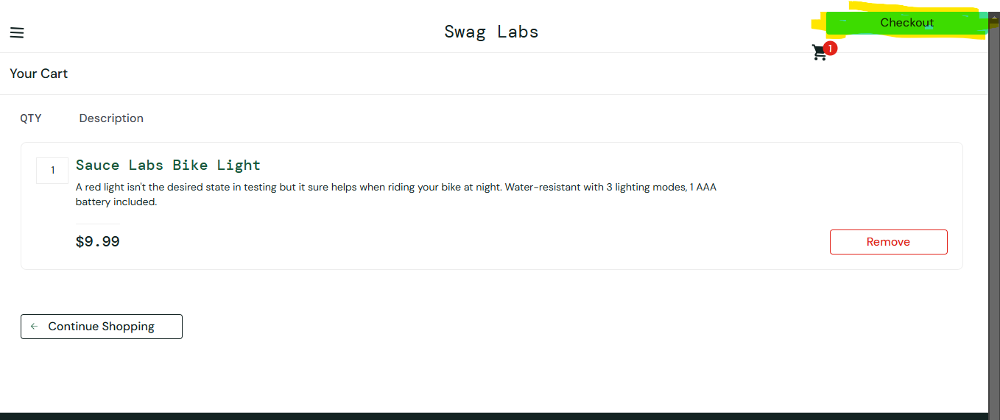

## 7 - Campo "Last Name" não permite preenchimento quando estiver logado com o user "problem_user"
Após incluir produtos no carrinho, e avançar na tela de checkout, a aplicação permite digitar no campo name e no campo Postal Code, porém ao posicionar o cursor no last Name e digitar, o conteúdo do Name é sobreescrito pelo que está sendo digitado.
Este é um bug crítico, pois impede o cliente de finalizar a compra.  
      <video controls src="20241125-1756-00.5518627.mp4" title="Title"></video>

